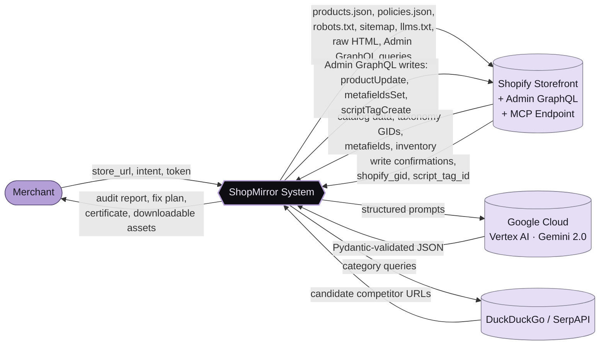
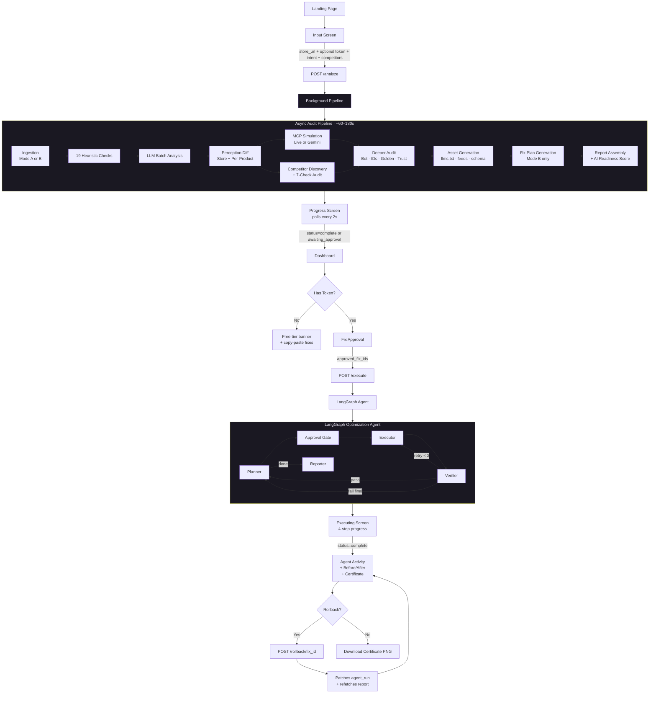
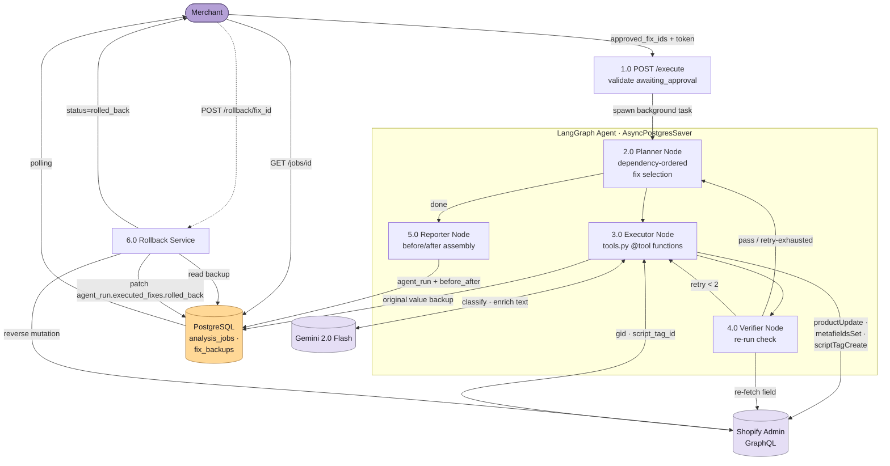
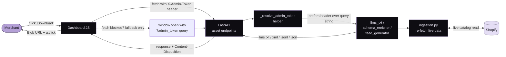

# ShopMirror — Product Requirements Document

**Observability and Remediation Infrastructure for Agentic Commerce Readiness**

| Field | Detail |
|---|---|
| Product | ShopMirror |
| Document Type | Product Requirements Document (PRD) |
| Version | 2.0 (April 2026 — post-implementation revision) |
| Hackathon | Kasparro Agentic Commerce Hackathon |
| Track | Track 5 — AI Representation Optimizer |
| Build Window | 8 days (Days 1–8 of 15-day total) |
| Status | Implemented and live; this document reflects the shipped product |
| Stack | Python 3.12 / FastAPI / React 18 / PostgreSQL 15 / LangGraph / LangChain / Google Cloud Vertex AI |

> **How to read this document.** Sections 1–3 explain why the product exists and the user model. Section 4 specifies every shipped feature in detail — what it does, how it works, what it depends on, what its failure modes are, and how it degrades when something goes wrong. Sections 5–9 cover scope boundaries, success metrics, positioning, business model, and the demo script. The companion TechSpec document covers the same surfaces from an engineering perspective.

---

## 1. Executive Summary

> **Judge-facing summary.** This document is intentionally written to answer the judging questions directly, not just to describe features.
>
> - **Problem and why it matters:** merchants can be technically connected to AI shopping channels and still remain invisible because their product data is incomplete, inconsistent, or not machine-readable.
> - **Target user and current experience:** the primary user is the Shopify merchant, who currently has no feedback loop for why AI agents skip, misclassify, or misdescribe their products.
> - **What we built and the core journey:** the merchant enters a store URL, receives an AI-readiness audit, reviews evidence-backed gaps, and optionally approves only the fixes the system can safely execute and verify.
> - **Key product decisions and reasoning:** we prioritized observability, reversibility, and defensible scoring over flashy but weakly grounded AI claims.
> - **What we chose not to build:** we excluded fake automation, broad autonomous storefront mutation, and expensive features that would be impressive in a demo but hard to trust in production.
> - **Main tradeoff:** we deliberately narrowed scope to the problems we could diagnose clearly, explain honestly, and either verify after fixing or route to manual guidance.

> **The Problem in One Paragraph**
> Shopify has solved connectivity to AI shopping platforms. Every eligible store now appears in Shopify Catalog and is theoretically discoverable by ChatGPT, Copilot, Gemini, and Perplexity. But connectivity is not visibility. A store with incomplete product data, missing structured attributes, inconsistent schema markup, untranslated markets, and vague policies remains invisible to AI agents even after Agentic Storefronts is enabled. Merchants have no way to see this gap, no way to measure it, and no way to close it. ShopMirror is built to solve exactly this.

ShopMirror is a merchant-facing diagnostic and remediation system for Shopify stores. It audits a store against the documented requirements of real AI shopping systems, identifies every structural gap causing AI invisibility, shows merchants the gap between how they intend to be represented and how AI agents currently perceive them, benchmarks them against Shopify competitors winning AI recommendations in their category, and autonomously fixes what it can while providing precise drafts and instructions for everything else.

This is not an SEO tool. This is not a generic AI content generator. This is observability infrastructure for the agentic commerce era — the layer between a merchant's store and the AI agents that increasingly mediate their customers' purchase decisions.

### 1.1 The One-Line Pitch

> An agentic AI system that audits Shopify merchant product data against AI shopping platform requirements, identifies every structural gap causing AI invisibility, and fixes them autonomously — turning products that AI agents skip into products AI agents recommend.

### 1.2 Why This Exists Now

Three things happened in 2025–2026 that made this product urgent:

- **Shopify activated Agentic Storefronts by default for all eligible US merchants on March 24, 2026.** Every paid Shopify store's products are now theoretically in front of ChatGPT's 800 million weekly users. Most stores will never see a single AI-attributed order because their data quality does not meet the requirements for AI agent matching.
- **AI-driven traffic to Shopify stores grew 693% during the 2025 holiday season.** The channel is real, growing, and already affecting merchant revenue distribution.
- **No tool exists that addresses this at the product data level for Shopify merchants.** OmniSEO, Profound, Goodie, and similar tools track brand mentions for content marketers. Nobody fixes Shopify product data structures for AI agent consumption.

---

## 2. Problem Definition

### 2.1 Root Cause Analysis

The real problem is not that merchants have bad data. It is that merchants wrote their product data for human browsers, not for AI agents. These are fundamentally different audiences with fundamentally different requirements.

A human browser can read "Premium amazing soft elegant vibe" and understand it is a clothing item. An AI agent cannot classify this product, cannot match it to a category query, and will not recommend it. The merchant does not know this is happening because the failure mode is silent — there is no error message, just absence.

| Failure Layer | What Goes Wrong | Real-World Impact |
|---|---|---|
| Findability | AI crawlers blocked by robots.txt; no sitemap; no llms.txt; markets untranslated | Product pages never indexed by AI shopping systems; international queries answered by competitors |
| Classifiability | Title has no category noun; product taxonomy unmapped; product_type field empty | AI cannot route product to any category query |
| Constraint Extraction | Material not in typed metafield; care instructions only in description prose; variant options unnamed | AI cannot answer pre-purchase questions; drops product from filtered queries |
| Data Consistency | Schema price differs from products.json price; availability contradicts inventory; SEO title contradicts product title | AI shows shoppers wrong information, eroding trust at the moment of decision |
| Trust Signals | No OfferShippingDetails / MerchantReturnPolicy in schema; policy too vague; no FAQ coverage | AI deprioritises merchant vs competitors with richer signals |
| Transaction Readiness | Inventory untracked; oversell policy enabled; checkout schema missing | AI-initiated transactions fail on delivery — the worst possible AI outcome |

### 2.2 Stakeholder Pain

**The Merchant**
- Cannot see how AI agents perceive their store — no feedback loop exists.
- Losing AI recommendation share to competitors with structurally cleaner data, without knowing why.
- Shopify Agentic Storefronts is enabled but generating zero orders — cause unknown.
- No actionable, Shopify-aware tool exists to diagnose or fix this.

**The Shopper**
- AI agents confidently recommend incorrect information about products.
- Sees wrong prices, incorrect availability, or incomplete specs.
- Clicks through from AI recommendation to find product description does not match what the agent said.

**Kasparro / Platform**
- AI recommendation quality depends entirely on merchant data quality.
- Poor merchant data degrades the entire agentic commerce ecosystem.
- No tooling exists to help merchants meet the structural requirements at scale.

---

## 3. Product Overview

### 3.1 What ShopMirror Does

ShopMirror runs as a two-phase system.

**Phase one — diagnosis:** It reads the store, runs deterministic structural checks across 5 pillars, runs a single batched LLM analysis pass on products to detect title classifiability and attribute presence, computes a 0–100 AI Readiness Score, builds a multi-channel compliance view, simulates the AI perception gap, probes a Gemini-driven MCP-style query simulation, benchmarks against Shopify competitors, and generates a dependency-ordered fix plan.

**Phase two — remediation:** A LangGraph-powered optimization agent plans fixes in dependency order, executes autonomous writes to Shopify (taxonomy, metafields, alt text, schema script tags) with merchant approval, verifies each fix worked, and provides precise copy-paste instructions and policy drafts for everything it cannot write automatically. Every write is reversible — the agent backs up the original value before touching anything and exposes a one-click rollback per fix.

### 3.2 System Context Diagram (Level-0 DFD)



### 3.3 User Workflow

| Step | What Merchant Does | What ShopMirror Does |
|---|---|---|
| 1 | Lands on the marketing page, clicks "Audit my store" | Routes to the input screen |
| 2 | Enters Shopify storefront URL | Validates URL via `/products.json` 200 + `products` key check |
| 3 | (Optional) Pastes Admin API token | Unlocks Mode B ingestion + autonomous fix execution |
| 4 | (Optional) Enters merchant intent statement | Used for perception-gap LLM analysis |
| 5 | (Optional) Enters 1–2 competitor store URLs | Bypasses competitor auto-discovery |
| 6 | Clicks Run audit | Async background job: ingestion → 19 structural checks → batched LLM → perception diff → Gemini MCP simulation → competitor benchmark → AI-visibility deep audit → channel compliance → fix plan |
| 7 | Watches the progress screen | Live status: 6 audit steps with progress percent, animated reveal grid |
| 8 | Lands on the dashboard | Hero score card, multi-channel compliance grid, deeper audit tiles, top issues, generated assets, perception diff, MCP results, competitor gaps, findings table, completeness heatmap, fix plan |
| 9 | (Paid) Reviews fix plan | Three sections: auto-fixable (preselected), copy-paste required (collapsible), needs manual setup |
| 10 | (Paid) Clicks "Apply N fixes" | Confirmation modal → LangGraph agent runs → executing screen with 4-step progress |
| 11 | (Paid) Reviews agent activity | Per-fix status with rollback button; reversed fixes update the certificate and pillar scores in real time |
| 12 | (Paid) Downloads readiness certificate | Canvas-rendered PNG with before/after score, top 3 fixes applied |
| 13 | (Optional) Exports artifacts | llms.txt, schema package, Google / Perplexity / ChatGPT feeds — all token-authenticated via `X-Admin-Token` header |

### 3.4 End-to-End User Journey



### 3.5 Tiered Model

**Free Tier (URL only — no token required)**
- Full structural audit on the first 10 products in the catalog (capped to keep the free path fast and inexpensive).
- 5-pillar AI Readiness Score and 5-channel compliance view.
- Gemini-driven MCP-style simulation of buyer queries (3 questions).
- Competitor structural comparison (auto-discovery via DuckDuckGo or SerpAPI when configured).
- Bot-access audit, identifier coverage audit, golden-record score, trust-signals score.
- Generated artifacts available for download: llms.txt, schema package, Google Feed, Perplexity Feed, ChatGPT Feed.
- Copy-paste fix instructions and drafts for all findings.
- Cost target per analysis: under $0.05.

**Paid Tier (Admin token supplied at audit time)**
- Everything in Free, plus:
- Full-catalog scan (no 10-product cap).
- Mode B ingestion: typed metafields, SEO fields, taxonomy GIDs, inventory tracking, image alt text, market translations.
- Per-product perception drift (intended vs AI-extracted with `cannot_determine` flags).
- LangGraph autonomous fix execution with verification loop.
- One-click per-fix rollback.
- Before/after pillar comparison.
- Downloadable AI Readiness Certificate.
- Cost target per analysis: under $0.50.

The token is **never persisted** in the database. `analysis_jobs.has_token` is a boolean flag only. The token is held in the request body for `/analyze` and `/execute`, in the `X-Admin-Token` header for asset downloads, and never written to disk.

---

## 4. Data Flow Diagrams (Feature-Level)

### 4.0 Feature DFD — Audit Phase (Level-1)

```mermaid
flowchart TD
    M([Merchant]):::actor
    DB[(PostgreSQL<br/>analysis_jobs · fix_backups)]:::store
    SH[(Shopify)]:::ext
    GE[(Gemini 2.0 Flash)]:::ext
    SE[(Search · DDG/SerpAPI)]:::ext

    M -->|1. store_url + token| P1[1.0 Validate URL<br/>detect_shopify]
    P1 -->|2. job_id| DB
    P1 -->|2. job_id| M

    P1 --> P2[2.0 Ingestion<br/>fetch_public_data /<br/>fetch_admin_data /<br/>fetch_bulk_products]
    P2 <-->|catalog · policies ·<br/>metafields · taxonomy| SH
    P2 -->|MerchantData| P3

    P3[3.0 Heuristics<br/>19 deterministic checks] -->|Finding[]| P5
    P2 --> P4[4.0 LLM Batch Analysis<br/>batched, 15/call]
    P4 <-->|structured JSON| GE
    P4 -->|ProductAnalysis[]| P3

    P5[5.0 Perception Diff<br/>compute_combined_perception]
    P5 <-->|intent vs AI view| GE

    P3 --> P6[6.0 MCP Simulation<br/>run_mcp_simulation]
    P6 <-->|live MCP or Gemini fallback| SH
    P6 <-->|fallback simulation| GE

    P3 --> P7[7.0 Competitor Audit<br/>discovery + detect_shopify<br/>+ 7-check audit]
    P7 <-->|category queries| SE
    P7 <-->|public storefront data| SH

    P3 --> P8[8.0 Deeper Audit<br/>bot · identifiers ·<br/>golden record · trust]
    P2 --> P8

    P2 --> P9[9.0 Asset Generation<br/>llms.txt · feeds · schema]

    P3 --> P10[10.0 Report Builder<br/>assemble_report +<br/>AI Readiness Score +<br/>Channel Compliance]
    P5 --> P10
    P6 --> P10
    P7 --> P10
    P8 --> P10
    P9 --> P10

    P10 -->|report_json| DB
    DB -->|GET /jobs/id| M

    classDef actor fill:#B4A0D6,stroke:#5A4A78,color:#1a1822
    classDef store fill:#FFD896,stroke:#A87B3C,color:#1a1822
    classDef ext fill:#E5DEF5,stroke:#7E7B8C,color:#1a1822
```

### 4.1 Feature DFD — Remediation Phase (Level-1)



### 4.2 Feature DFD — Asset Download Path



---

## 5. Feature Specifications

### Feature 1 — Data Ingestion

Foundation layer. Runs first in every analysis job. Two modes depending on what the merchant provides.

**Mode A — URL only**
- `products.json` — paginated, 250 per page, capped to first 10 products on the free tier.
- `collections.json`.
- `policies.json` (refund, shipping, privacy).
- `robots.txt` — plain HTTP fetch.
- `sitemap.xml` — presence + product URL parsing.
- `llms.txt` — presence check.
- Raw HTML of up to 5 product pages via httpx (no JavaScript execution). Extracts JSON-LD blocks, meta tags, and checks if price appears in raw source.

**Mode B — URL + Admin Token (adds via Admin GraphQL)**
- Full metafields per product across all namespaces.
- SEO fields per product (`metaTitle`, `metaDescription`).
- Shopify Standard Product Taxonomy category GID per product.
- Inventory per variant (`tracked` / `untracked` / `policy` setting).
- Image alt text for all product images.
- Market translations per active market.
- Store-level `MetafieldDefinition` objects.

For catalogs with more than 150 products, ingestion uses Shopify's Bulk Operations API (`bulkOperationRunQuery`) to avoid pagination rate limits. The bulk operation submits an async query, polls until complete, then downloads the JSONL result.

**Edge cases — explicit behavior**

| Scenario | Behavior |
|---|---|
| `products.json` returns 0 | Mark `catalog_not_public`, run HTML-only checks |
| Store password protected (401) | Flag `store_private`, still run robots.txt and homepage schema |
| HTTP 429 rate limit | Exponential backoff (1s, 2s, 4s), max 3 retries, then graceful partial result with a warning finding |
| Store URL not Shopify | `validate_shopify_url` raises HTTPException 400 on `/analyze` |
| Free tier with > 10 products | Cap to first 10 by variant count; report payload includes `scan_limited: true` and `full_product_count` so the dashboard renders the "Run full scan" upgrade banner |
| Admin token re-ingest fails | Fix agent falls back to a stub `MerchantData` so reporter still emits a degraded final report instead of a hard error |

---

### Feature 2 — 19-Check Structural Audit (5 Pillars)

> **Design Principle.** Zero LLM calls inside the audit itself (LLM analysis runs separately and feeds C2 results back in). Pure deterministic Python. Every check maps to a published specification — Shopify documentation, schema.org, OpenAI/Google AI commerce requirements, or the llms.txt standard. Every finding is binary pass/fail with a cited source. This makes the audit explainable and reproducible.

#### Pillar 1 — Discoverability (5 checks)

| Check | What Is Tested | Severity if Fail | Source |
|---|---|---|---|
| D1a | robots.txt does not block `PerplexityBot` / `GPTBot` / similar AI crawlers | MEDIUM per blocked bot | Perplexity / OpenAI crawler docs — affects web-index AI only, not the Shopify Catalog pipeline |
| D1b | Shopify Catalog eligibility: product has taxonomy GID mapped, title non-empty, price set | CRITICAL | Shopify Catalog API docs — required fields for AI catalog inclusion |
| D2 | sitemap.xml present and contains `/products/` URLs | HIGH | Shopify SEO documentation |
| D3 | llms.txt present at store root | MEDIUM | llms.txt emerging standard |
| D5 | Shopify Markets: active markets have translated product titles and descriptions | HIGH | Shopify Markets API — AI agents serve international queries in local language |

> **Why D1 is split.** ChatGPT Shopping and Shopify Agentic Storefronts use Shopify's Catalog API directly — they do not crawl merchant websites. Blocking `GPTBot` in robots.txt has no effect on Shopify Catalog visibility. D1a accurately covers web-index AI (Perplexity, Bing AI); D1b covers the actual Shopify platform path. Many earlier audits miscoded D1 as CRITICAL — that produced false alarms on otherwise healthy Shopify stores.

#### Pillar 2 — Completeness (6 checks)

| Check | What Is Tested | Severity if Fail | Source |
|---|---|---|---|
| C1 | Product mapped to Shopify Standard Product Taxonomy (category GID set) | CRITICAL | Shopify Standard Product Taxonomy 2024 — the actual routing layer for Shopify Catalog, Google Shopping, and Meta Catalog |
| C2 | Product title contains a category noun (LLM check) | CRITICAL | GEO research: AI cannot classify brand-name-only titles |
| C3 | Variant options named (not Option1 / Option2 / Title) | HIGH | Shopify: unnamed options break agentic variant resolution |
| C4 | GTIN present, OR (vendor non-empty AND SKU non-empty) | HIGH | Google Merchant Center feed spec: product identifier required for Shopping inclusion |
| C5 | Typed `MetafieldDefinition` objects exist for `material`, `care_instructions` | HIGH | Shopify Search & Discovery uses typed definitions for filtering — raw string metafields are not equivalent |
| C6 | Image alt text on 70 %+ of product images | MEDIUM | AI crawler: alt text is the primary image signal |

> **Why C1 changed.** An arbitrary `product_type` string (e.g. "stuff") passes the legacy check but provides no routing value. Shopify's Standard Taxonomy GID (e.g. `gid://shopify/TaxonomyCategory/aa-1-1`) is what Shopify's catalog system uses for category routing. The autonomous fix maps products via Gemini, then writes the taxonomy GID via `productUpdate` Admin GraphQL mutation.

#### Pillar 3 — Consistency (3 checks)

| Check | What Is Tested | Severity if Fail | Source |
|---|---|---|---|
| Con1 | Schema.org price matches products.json price (within $0.01) | CRITICAL | AI shows shoppers wrong price — trust destruction |
| Con2 | Schema availability matches actual inventory state | CRITICAL | Failed agentic transactions from stale availability |
| Con3 | SEO title/description consistent with product title (Mode B only) | MEDIUM | Cross-surface consistency for AI aggregation |

#### Pillar 4 — Trust and Policies (3 checks)

| Check | What Is Tested | Severity if Fail | Source |
|---|---|---|---|
| T1 | Refund policy contains explicit number of days (regex: `\d+\s*days`) | HIGH | AI constraint matching: "within a few weeks" is unextractable |
| T2 | Shipping policy names at least one region or country | HIGH | AI location-filtered queries require explicit region data |
| T4 | `OfferShippingDetails` + `hasMerchantReturnPolicy` in schema Offer | CRITICAL | Shopify / IFG: products invisible to AI checkout without these — auto-fixed via Script Tags injection |

> **Why T3 was removed.** AggregateRating schema is absent from virtually every Shopify store's default theme. A check that fails universally provides zero diagnostic signal. T3 was removed; the slot was reallocated to D5 (Markets translation). T4 was upgraded from copy-paste instructions to autonomous Script Tags injection — the agent generates the JSON-LD and registers it via `scriptTagCreate`, which writes nothing to the merchant's theme files.

#### Pillar 5 — Agentic Transaction Readiness (2 checks)

| Check | What Is Tested | Severity if Fail | Source |
|---|---|---|---|
| A1 | `inventory_management` not null on variants (inventory tracked) | HIGH | Untracked inventory means agent cannot verify availability |
| A2 | `inventory_policy` is not `continue` when `inventory_management` is `shopify` | CRITICAL | Oversell risk: agent confirms stock, transaction fails on delivery |

#### Severity Weighting for Product Scoring

| Severity | Weight | Meaning |
|---|---|---|
| CRITICAL | 10 | Blocks AI inclusion entirely or causes active misinformation |
| HIGH | 6 | Reduces AI ranking or prevents answering common queries |
| MEDIUM | 2 | Reduces conversion after inclusion, lower priority |

Per-product gap score = sum of `severity_weight × failed_checks` for that product. Top 5 products by gap score are the worst performers shown in the dashboard's "Most Problematic Products" section.

---

### Feature 3 — LLM Batch Analysis

Supports Check C2 (title category noun detection) and provides attribute presence flags. Single batched call per 15 products using Gemini 2.0 Flash via Google Cloud Vertex AI with Pydantic structured output via `with_structured_output(...)`. Zero free-text responses.

**Output schema per product**

| Field | Type | Purpose |
|---|---|---|
| product_id | string | Links result back to product |
| title_contains_category_noun | boolean | Drives Check C2 pass/fail |
| title_category_noun | string \| null | What noun was found (or should be added) |
| description_has_material | boolean | Cross-validated against material keyword regex |
| description_has_use_case | boolean | Feeds into perception diff |
| description_has_specs | boolean | Feeds into perception diff |
| missing_vocabulary | list[string] (max 3) | e.g. `['material', 'occasion', 'size range']` |

**Cross-validation rule.** If `description_has_material = true` but no material keyword is found by regex (cotton, polyester, leather, wood, steel, wool, linen, plastic, ceramic, gold, silver, nylon, silk), override to `false` and flag uncertain. This prevents LLM hallucination from propagating into audit findings.

---

### Feature 4 — Perception Diff

The perception diff has two layers — both render in the dashboard's Perception tab.

**4A — Store-level perception summary.** One LLM call. Inputs: merchant_intent (or inferred from store name + collections + tags, flagged as inferred), store-level audit summary, worst-performing pillar, top 3 critical findings. Outputs: `intended_positioning`, `ai_perception`, `gap_reasons[]`. Renders as a side-by-side card with "Your Intent" (good-color) and "AI Perception" (bad-color) panes plus a "Why the gap exists" list of reasons.

**4B — Per-product perception drift.** Two LLM calls per product (10 total for 5 products) on worst 5 by gap score. Call 1: what the merchant intends this product to communicate (uses merchant_intent + full product data). Call 2: what AI can actually extract using ONLY machine-readable fields (title, product_type, metafields, schema markup, first 100 words of description). Output: `intended`, `ai_extracted`, `cannot_determine[]`, `root_finding_ids[]`. Renders as a per-product card with intended-vs-extracted side-by-side and "cannot determine" chips for the missing dimensions.

The Call 2 prompt is constrained: "Do NOT use any external knowledge. Do NOT infer information not present. If information is not in the data, state that you cannot determine it." This is what makes the gap honest — the model is forced to behave as an AI shopping agent that has only Shopify's structured data to work with.

---

### Feature 5 — Competitor Discovery and Comparison

Finds competitors via targeted search, validates them as Shopify stores, then runs a focused public-data audit on the top 3 verified.

1. **Query generation.** Queries the merchant's Shopify Standard Taxonomy category using DuckDuckGo (free, no key) or SerpAPI when `SERPAPI_KEY` is configured.
2. **Shopify validation.** `detect_shopify()` is applied to every result — only verified Shopify stores proceed; non-Shopify results are silently excluded.
3. **Structural extraction.** Runs a lightweight 7-check public-data audit on top 3 verified Shopify competitor stores (D1a, D1b, C1, C3, C4, C6, T1, T2 — public-storefront-only checks).
4. **Gap comparison.** Side-by-side table showing structural advantages competitors have that the merchant lacks. Each gap is rendered with a plain-English headline plus impact statement (e.g. "Listed in Shopify's AI catalog → Their products show up inside Shopify's own AI-powered discovery tool").

**Modes.**
- **Auto.** No URLs entered. Backend auto-discovers up to 5 candidates, audits up to 3 verified Shopify ones.
- **Manual.** Up to 2 URLs entered by the merchant. Backend runs `detect_shopify()` and audits the verified ones. URLs typed in manual mode are explicitly cleared when the user toggles back to auto so they cannot be silently submitted.

**Framing.** "These Shopify stores appear when someone searches for your product category. Here is what structural advantages they have." No claims about actual AI recommendation rates or revenue impact — those would be unverifiable.

The competitor section is also re-runnable from the dashboard via `POST /jobs/{id}/competitors`. Results are patched back into the stored report so the next `GET /jobs/{id}` poll returns them as `competitor_comparison`.

---

### Feature 6 — Storefront MCP Simulation

Every Shopify store has a built-in MCP endpoint at `{store}.myshopify.com/api/mcp`. ShopMirror checks for it, but in practice most stores return non-200 against it during the analysis window. So the production path is a **structured Gemini simulation** that uses ONLY the store's machine-readable data.

**Question generation.** 10 questions from real merchant data (3 free, 10 paid):

| Question Template | What It Tests | Maps To Check |
|---|---|---|
| What {category} do you sell? | Product classification | C1, C2 |
| What material is the {top_product} made from? | Attribute extractability | C5 |
| Do you have anything under ${price_bracket}? | Price data availability | Con1 |
| What is your return policy? | Policy clarity | T1 |
| How long does shipping take? | Shipping information | T2 |
| Does the {top_product} come in different sizes? | Variant data completeness | C3 |
| Do you ship internationally? | Region coverage | T2 |
| Is the {top_product} currently in stock? | Inventory accuracy | A1, A2 |
| Can I return a sale item? | Policy specificity | T1 |
| What makes your products different? | Brand differentiation | C5 |

**Response classification.**
- **ANSWERED.** Response contains relevant, accurate, verifiable information.
- **UNANSWERED.** Response says it does not have the information (correct but missing).
- **WRONG.** Response contains a verifiable factual error vs ground truth data.
- Each classification maps back to specific audit findings explaining why.

**Honesty in the UI.** The MCPSimulation component shows a clear mode label — green dot + "Live Shopify MCP endpoint — real AI agent responses" when the live MCP path returned data, amber dot + "Simulated AI agent responses (based on your store's machine-readable data)" otherwise. This prevents the demo from misrepresenting Gemini output as ChatGPT output.

---

### Feature 7 — LangGraph Optimization Agent

> **Design Philosophy.** Single planner node + tool-based execution + verification loop. Not multi-agent. The intelligence is in dependency-aware ordering and self-verification, not in having many agents with fancy names.

#### Graph structure

| Node | Role | Decision Made |
|---|---|---|
| Planner | Reads current audit state, decides next fix | Which fix has highest impact given dependencies |
| Approval Gate | Pass-through (approval is collected before agent starts via the API) | Routes to executor if approved fixes remain, else reporter |
| Executor | Runs the chosen tool | One tool per iteration, never bulk |
| Verifier | Re-runs the specific check just addressed | Pass: back to Planner. Fail (retry < 2): retry. Else: flag manual. |
| Reporter | Produces final before/after summary | Runs when all approved fixes resolved or flagged. Terminal node. |

The graph uses `AsyncPostgresSaver` for state persistence — wired on the same day as the graph definition itself, never deferred — so a partially complete agent run survives a backend restart.

#### Fix dependency order

The planner follows this order. It does not deviate unless a dependency is already satisfied:

1. `map_taxonomy` — taxonomy GID is the routing layer; everything depends on it.
2. `create_metafield_definitions` — typed definitions must exist before filling values.
3. `classify_product_type` — `product_type` text for title-improvement context.
4. `improve_title` — needs taxonomy + product_type context.
5. `fill_metafield` — extract from description into typed fields.
6. `generate_alt_text` — needs title + taxonomy context.
7. `inject_schema_script` — schema injection based on now-corrected product data.
8. `generate_schema_snippet` — copy-paste schema backup for T4 (non-Script-Tags path).
9. `suggest_policy_fix` — least urgent, human must apply.

Within the same dependency level: sort by `severity_weight × affected_count` descending. CRITICAL × 14 products beats HIGH × 18 products.

#### Executor tools

| Tool | What It Does | Write Type | Reversible |
|---|---|---|---|
| `map_taxonomy` | Gemini classifies product to a Shopify Standard Taxonomy GID; only writes if Gemini returns a GID matching Shopify's published taxonomy list | `productUpdate` (category field) | Yes — original GID backed up |
| `create_metafield_definitions` | Creates typed `MetafieldDefinition` for `material` and `care_instructions` if they don't exist yet | `metafieldDefinitionCreate` | N/A — idempotent |
| `classify_product_type` | LLM classifies; only writes if `confidence='high'` | `productUpdate` | Yes — original `product_type` backed up |
| `improve_title` | LLM adds category noun, preserves brand name, max 70 chars | `productUpdate` | Yes — original title in metafield backup |
| `fill_metafield` | Extracts material / care / specs from description, cross-validates with regex | `metafieldsSet` | Yes — delete metafield to revert |
| `generate_alt_text` | LLM generates descriptive alt text for product images | `productImageUpdate` | Yes — original alt text backed up |
| `inject_schema_script` | Generates complete JSON-LD with `OfferShippingDetails` + `MerchantReturnPolicy`, registers via `scriptTagCreate` | `scriptTagCreate` | Yes — `script_tag_id` stored, rollback via `scriptTagDelete` |
| `generate_schema_snippet` | Produces a JSON-LD copy-paste block (non-Script-Tags path) | None | N/A |
| `suggest_policy_fix` | Drafts replacement policy text based on current text | None | N/A |

#### Rollback mechanism

- Before every write, the original value is saved to a row in `fix_backups` keyed by `fix_id` (UUID-stable).
- For Script Tag injections, the rollback row stores `script_tag_id` and rollback issues `scriptTagDelete`.
- The rollback endpoint `POST /jobs/{job_id}/rollback/{fix_id}` validates the backup belongs to the calling job, restores the original value via the appropriate Admin GraphQL mutation, and patches the stored `agent_run.executed_fixes[].rolled_back = true` flag plus `agent_run.rolled_back_fix_ids[]` so the dashboard renders the rollback persistently across page reloads.
- Policy and copy-paste suggestions have no rollback (no auto-write).

#### Verification loop

After each tool execution, the Verifier re-runs only the specific check(s) the fix addressed.
- Check passes → Planner advances.
- Check still fails (retry < 2) → retry with adjusted approach.
- Retry exhausted → flag for manual action, Planner advances.
- Hard cap: 50 iterations per agent run. Beyond that, force route to reporter to prevent infinite loops.

---

### Feature 8 — Before/After Report

Runs after all agent iterations complete. The reporter node assembles a comparison and patches it into the stored report as `agent_run.before_after`.

- Per-pillar score before vs after, rendered as a paper-card hero with `+N pts` delta.
- Per-pillar breakdown rows with animated progress bars.
- "Fixed" chips (improved checks) and "Still needs attention" chips (unchanged checks).
- Copy-paste package — every generated schema snippet, policy draft, and FAQ template ready to copy with a one-click button.

The before/after pillar scores are computed using the same `overallFromPillars` weighted utility used by the dashboard hero so the two views never diverge.

---

### Feature 9 — AI Readiness Score (0–100)

A single weighted composite score across all 5 pillars, displayed as a 140 px display-font numeral on the dashboard hero card and color-coded by band.

**Formula.**
- Each pillar contributes a weighted percentage: Discoverability 20%, Completeness 30%, Consistency 20%, Trust_Policies 15%, Transaction 15%.
- Within each pillar: `(checks_passed / checks_total) × pillar_weight × 100`.
- The frontend re-normalizes against weight actually applied so missing pillars don't drag the score to 0.
- Rounded to nearest integer (0–100).

**Bands.**
- 0–39 → Critical (red).
- 40–59 → Needs work (amber).
- 60–79 → Solid (info-blue).
- 80+ → Excellent (green).

**Score consistency.** A single utility (`utils/score.ts`) is used for the hero score, the pillar bars, the BeforeAfterReport pillar deltas, and the readiness certificate canvas. The utility normalizes any score (0–1 fraction or 0–100 percent) so the pillar bars accept either input shape without producing a mismatch.

---

### Feature 10 — Product Data Completeness Heatmap

Visual grid — products on the Y-axis, required fields on the X-axis. Each cell colored:
- **Red** — check fails for this product.
- **Green-tint** — check passes.

**Columns.** D1b Catalog · D2 Sitemap · C1 Taxonomy · C2 Title · C3 Variants · C4 GTIN · C5 Metafields · C6 Alt Text · Con1 Price · Con2 Stock · T1 Returns · A1 Tracked · A2 Oversell. The grid filters columns dynamically to those that have at least one failing cell — but only when at least 3 columns survive the filter (otherwise it shows all columns to keep the visual readable).

The heatmap renders the worst 25 products by issue count and shows a footer message when more products exist. Each row's Issues count cell is colored green (0), amber (1–4), or red (5+).

---

### Feature 11 — AI Query Match Simulator

Answers the question the audit alone cannot: "would my products actually appear if someone asked AI for them?"

1. System generates default queries from the merchant's taxonomy + price range (free tier: 1 query, paid tier: 5 + custom input).
2. One Gemini call parses each query into structured attributes: `{category, price_max, price_min, attributes: list[str]}`.
3. Deterministic matching: for each product, check if machine-readable fields (taxonomy, typed metafields, title, price) satisfy every attribute. Material keywords must be in the metafield value, not in description prose.
4. Output: "{N} of {total} products match this query. {M} fail because material metafield is empty."
5. After agent fixes: re-run the same queries automatically, show improvement.

This is the evidence-of-impact feature — it shows the causal link between structural fixes and AI query matching potential without making unverifiable claims about real ChatGPT results.

---

### Feature 12 — Multi-Channel Compliance Dashboard

AI shopping is five channels, not one. A single compliance view across all of them — rendered as a 5-tile row on the dashboard overview.

| Channel | Key Requirements | Checks That Map |
|---|---|---|
| Shopify Catalog | Taxonomy GID, title, price, inventory tracked | D1b, C1, Con1, A1, A2 |
| Google Shopping | GTIN or brand + MPN, taxonomy category, price, availability | C4, C1, Con1, Con2 |
| Meta Catalog | `product_type` text, price, image, description | C2, C6, Con1 |
| Perplexity Web | robots.txt open, sitemap, llms.txt | D1a, D2, D3 |
| ChatGPT Shopping | OfferShippingDetails in schema, structured policies | T4, T1, T2 |

Each tile shows: **READY** / **PARTIAL** / **BLOCKED** / **NOT_READY** with the count of issue check_ids causing that status.

---

### Feature 13 — AI Readiness Certificate

After agent execution and re-audit, a one-page canvas-rendered certificate is generated:

- Store name + domain.
- Before score → after score with point delta.
- Checks improved count.
- Top 3 fixes applied (excluding any that have been rolled back).
- Date of certification.

**Rendering details.** The canvas uses DPR scaling (`window.devicePixelRatio`) for sharp output on retina displays. It uses only standard Canvas2D primitives — no `ctx.letterSpacing` (which is silently dropped on Firefox / Safari). The visual palette matches the dashboard ink theme: `#0E0D12` background, `#B4A0D6` violet accent, `#8FB89A` good-green for the after score, `#D57A78` bad-red for the before score.

**Export.** PNG via `canvas.toDataURL()`. The certificate auto-rerenders when a fix is rolled back (the rollback callback refetches the report, which triggers the `useEffect` dependency).

**Business function.** Retention mechanism (merchants return to improve their score) and viral distribution (shared in Shopify communities and on social media).

---

### Feature 14 — Generated Asset Exports

The dashboard surfaces five downloadable assets in a "Ready to Export" row. Each downloads via a JS-issued `fetch` with the admin token sent in an `X-Admin-Token` HTTP header — never as a query string. The response is converted to a Blob and triggered as a download via a temporary `<a>` element. This keeps the admin token out of browser history, referrer headers, and any web logs along the way.

| Asset | Endpoint | Content-Type | Filename |
|---|---|---|---|
| llms.txt | `GET /jobs/{id}/llms-txt` | `text/plain` | `llms-{id8}.txt` |
| Schema Package | `GET /jobs/{id}/schema-package` | `application/json` | `schema-{id8}.json` |
| Google Feed | `GET /jobs/{id}/feeds/google` | `application/xml` | `google-feed-{id8}.xml` |
| Perplexity Feed | `GET /jobs/{id}/feeds/perplexity` | `application/xml` | `perplexity-feed-{id8}.xml` |
| ChatGPT Feed | `GET /jobs/{id}/feeds/chatgpt` | `application/x-ndjson` | `chatgpt-feed-{id8}.jsonl` |

If the JS download path is blocked (rare; e.g. service worker interception), the UI gracefully degrades to opening a new tab with the legacy `?admin_token=…` query parameter as a fallback. The fallback is intentionally a degraded path — the production code path is the header-based one.

---

### Feature 15 — Deeper Audit (Bot Access · Identifiers · Golden Record · Trust Signals)

Four supplementary audits run alongside the main pipeline and surface as a 4-tile row on the dashboard overview ("Deeper audit · What's under the hood"):

| Tile | What It Measures | Color Logic |
|---|---|---|
| Bot access | Count of AI bots blocked vs allowed in robots.txt | Green if 0 blocked, amber otherwise |
| Identifiers | GTIN / barcode / MPN coverage percentage; count of products without an identifier | Green ≥ 70 %, amber ≥ 40 %, red below |
| Golden record | Catalog data integrity composite score | Same band logic as identifiers |
| Trust signals | Policy clarity, shipping, returns composite score | Same band logic as identifiers |

A null measurement renders neutral grey with `'—'` so the dashboard doesn't pretend a missing audit is a failure. Each audit is also exposed via a dedicated GET endpoint (`/jobs/{id}/bot-access`, `/jobs/{id}/identifiers`, `/jobs/{id}/golden-record`, `/jobs/{id}/trust-signals`) for programmatic access.

---

### Feature 16 — AI Visibility Probe (Live Multi-LLM)

`POST /jobs/{id}/ai-visibility` runs a live multi-provider LLM probe with the merchant's actual prompts (or a generated default set). Default provider is Gemini; additional providers can be passed via the request `providers` field. Result is patched into the stored report as `ai_visibility` and surfaced on demand.

This is the only feature in the system that calls a real-time LLM at the merchant's request rather than as part of the pipeline. It is rate-limited at the model layer and budget-capped per merchant.

---

### Feature 17 — Copy Rewriter (Per-Channel)

`POST /jobs/{id}/copy-rewrite` rewrites top products' copy per channel (e.g. Shopify storefront vs Google Shopping vs Perplexity-friendly description). Limited to N products per call (default 10). Rewrites are returned as drafts only — never auto-applied. Channel selection and product selection are configurable via the request body.

---

### Feature 18 — FAQ Schema Generator

`POST /jobs/{id}/faq-schema` generates `FAQPage` JSON-LD for top products (default 10). Output is a copy-paste block ready to drop into the theme. Never auto-injected — FAQ content is more sensitive than other schema and merits human review.

---

## 6. Resilience and Production Maturity

These behaviors are part of the shipped product, not aspirational. They were added to the codebase based on real failure modes observed during dev-store testing.

### 6.1 Failure isolation

| Surface | Failure Mode | What the User Sees |
|---|---|---|
| Analysis pipeline crash | Background task raises | Job status flips to `failed` with `error_message`; dashboard preserves any prior report in memory and shows the error inline rather than dumping the user back to the input screen |
| Execute crash | Agent task raises after `/execute` returned 202 | Same: job flips to `failed`, dashboard stays put with the pre-execution report intact |
| MCP endpoint 5xx | Live MCP unavailable | Falls back to Gemini-driven simulation; UI label flips to "Simulated AI agent responses" with an amber dot |
| Competitor discovery returns 0 | DDG / SerpAPI failure | Returns `status="empty"` + a human-readable message; dashboard shows the discovery panel with the message rather than a blank competitor table |
| Rollback fails on Shopify side | GraphQL error | Per-fix `rollbackError` rendered inline on the FixRow; other fixes still rollback-able |
| Asset download fetch blocked | Service worker / extension intercepts | Falls back to opening a new tab with the legacy query-string token |
| LLM returns malformed JSON | Pydantic validation fails | Retry once via `with_structured_output`; if still malformed, that batch is marked unanalysed and the audit continues |
| Admin re-ingestion fails during fix | Network / token revoked | Agent falls back to a stub `MerchantData` so the reporter still emits a degraded final report |

### 6.2 Score consistency invariants

- The hero score, the pillar bars, the certificate, and the BeforeAfterReport delta are all computed from the same `overallFromPillars` utility.
- All score inputs are passed through `normalizeScore` which accepts both 0–1 fractions and 0–100 percents and clamps the result to `[0, 100]`.
- Missing pillars don't drag the score to zero — the utility re-normalizes against the weight actually applied.

### 6.3 Token security

- Admin token is supplied in the request body for `/analyze` and `/execute` (HTTPS-only).
- Asset endpoints accept either an `X-Admin-Token` header (preferred) or a `?admin_token=` query param (legacy fallback). The dashboard always uses the header.
- The token is **never persisted** — `analysis_jobs.has_token` is a boolean only.
- The fix backup table stores no tokens, only Shopify GIDs and the raw original/new field values.

### 6.4 Defensive UI

- `report.pillars`, `report.findings`, `report.channel_compliance`, `report.copy_paste_package`, `worst_5_products`, `failing_check_ids`, and `blocking_check_ids` are all guarded against `undefined` via `?? {}` / `?? []` so a partial / degraded report never crashes the dashboard.
- The polling loop captures the prior `report` via React closure so a failed re-analysis starting from a state with a prior report still has a non-null fallback.
- `handleSubmit` defensively clears `report` and `jobStatus` before starting a new analysis so a failed re-run can never resurrect a prior session's report through the polling closure.
- The progress screen has separate step lists for the audit pipeline and the execute pipeline. During execution, the user sees "Re-fetching live store data → Applying autonomous fixes → Verifying writes → Building before/after report", not the audit steps.

### 6.5 Free-tier UX preservation

When a free-tier user clicks "Run full scan" on the products tab, the dashboard restarts to the input screen with the store URL pre-filled — they do not have to re-type it. The admin token field is intentionally left empty since the upgrade path requires the merchant to add one.

---

## 7. Explicit Scope Exclusions

These were considered and deliberately excluded. Do not revisit them during the build.

| Feature | Why Excluded |
|---|---|
| Real API probe calling (ChatGPT / Perplexity APIs) for the audit | Non-deterministic output, cannot do before/after, $1–6 per analysis at scale, TOS grey area |
| Semantic embedding / cosine similarity scoring | Thresholds are invented, hard to explain, judges will ask calibration source |
| Ghost Shopper personas | Gimmicky without hard methodology, MCP simulation achieves the same goal more honestly |
| Two-model Judge & Jury (Gemini + GPT) | $0.01 savings not worth two provider integrations and extra failure modes |
| Multi-agent LangGraph (4+ agents) | Fake complexity, shared state bugs, harder to explain, planner + tools achieves the same result |
| Direct theme mutation for schema | Liquid template variability makes this fragile; Script Tags injection is safer |
| Auto-writing policy text | Legal content, never auto-generate, always draft-and-review |
| Historical score tracking | Needs persistent user accounts; post-launch feature |
| Shopify App Store / OAuth flow | Partner approval takes weeks; custom app token is the correct hackathon approach |
| Playwright headless browser | Shopify SSR means raw HTML has everything needed; Playwright adds 3 s latency per page |
| Image vision analysis on all products | $4–12 per analysis for medium store; alt-text keyword check achieves the same finding |

---

## 8. Success Metrics

### 8.1 For the hackathon demo

| Metric | Target | How Measured |
|---|---|---|
| Checks passing after agent run | At least 8 / 19 improvement on demo store | Re-audit after fix execution |
| MCP questions answered after fixes | At least 3 previously UNANSWERED now ANSWERED | MCP re-run comparison |
| Time to complete full analysis | Under 3 minutes for 20-product dev store | Stopwatch during demo |
| Fix execution time | Under 60 seconds for 10 products | Stopwatch during demo |
| Zero demo-breaking errors | No crashes; graceful degradation on any failure | Live demo |

### 8.2 For real-world validity

| Metric | Target | Rationale |
|---|---|---|
| Cost per free analysis | Under $0.05 | Sustainable at any subscription price |
| Cost per paid analysis | Under $0.50 | Profitable at $29 +/month |
| False positive rate on checks | Under 10 % | Deterministic checks have defined pass/fail |
| LLM cross-validation catch rate | Prevents hallucination propagation | Material regex cross-check on LLM extraction |
| Rollback success rate | 100 % within session, persisted across reload | Admin GraphQL mutation success + report patching |

---

## 9. Competitive Positioning

| Capability | OmniSEO | Profound | Goodie | ShopMirror |
|---|---|---|---|---|
| Tracks AI visibility | Yes | Yes | Yes | Yes |
| Optimization playbooks | Yes (content) | Yes | Yes | Yes (product data) |
| Shopify product-level analysis | No | No | No | Yes |
| Uses real Shopify infrastructure (MCP, Catalog API) | No | No | No | Yes |
| Shows perception vs intent gap | No | No | No | Yes |
| Competitor comparison | Yes (mentions) | Yes | No | Yes (structural) |
| Autonomous fixes via Admin API | No | No | No | Yes |
| Per-fix rollback with persistence | No | No | No | Yes |
| Before/after verification | No | No | No | Yes |
| Multi-channel compliance view | No | No | No | Yes |
| Generated artifacts (llms.txt, feeds, schema) | No | No | No | Yes |
| Target customer | Enterprise content teams | Enterprise brands | Consumer brands | Shopify merchants |
| Pricing | $hundreds / month | Enterprise | Enterprise | $49 / month target |

> **The unique position.** Every competitor measures brand mentions and provides content strategy advice to marketing teams. ShopMirror is the only tool that operates at the product data level, uses Shopify's own infrastructure for simulation, executes fixes autonomously with rollback, verifies the fixes worked, and generates the export artifacts (llms.txt, schema, channel feeds) those fixes imply.

---

## 10. Business Model

### Pricing tiers

| Tier | Price | What Is Included |
|---|---|---|
| Free | $0 | URL-only audit on first 10 products, 5-pillar score, channel compliance, MCP simulation, competitor comparison, copy-paste fix instructions, all generated artifacts |
| Pro | $49 / month | Everything Free + full-catalog scan, Mode B ingestion, per-product perception drift, autonomous fix execution, rollback, before/after, certificate |
| Agency | $149 / month | Pro features across unlimited stores, bulk analysis, white-label report export |

### Market size

- 4 + million active Shopify merchants globally.
- 0.1 % adoption at $49 / month = $2.4 M ARR.
- 1 % adoption at $49 / month = $24 M ARR.
- AI-driven traffic to retail sites grew 805 % year-over-year in 2025.

---

## 11. Demo Script (3 minutes)

**Setup.** Dev store with intentionally broken data — brand-name-only titles, empty `product_type` fields, no metafields, vague policies, schema price mismatches, `PerplexityBot` blocked in robots.txt.

| Time | Spoken Line | What They See |
|---|---|---|
| 0:00–0:20 | "AI commerce grew 800 % in 2025. Every Shopify store is theoretically in front of 800 M ChatGPT users. Most will never see a single AI order — because their product data doesn't pass the structural requirements AI systems enforce." | Landing page → Audit my store |
| 0:20–0:40 | "Enter store URL. No login required. Analyzing now." | InputScreen → ProgressScreen with 6-step audit list and animated reveal grid |
| 0:40–0:55 | "AI Readiness Score: 31 of 100. Critical." | Dashboard hero card animates in with red band |
| 0:55–1:10 | "Five channels. Four blocked. One partial." | Multi-Channel Compliance grid: Shopify Catalog BLOCKED, Google Shopping PARTIAL |
| 1:10–1:25 | "Bot access OK. Identifier coverage 12 %. Golden record 38. Trust signals 41." | Deeper-audit tile row |
| 1:25–1:40 | "Here's the perception gap. Their intent: 'Premium sustainable outdoor gear.' AI extracts: 'unspecified consumer goods.' Five reasons why." | Perception tab: Intent vs Mirror card + per-product drift |
| 1:40–2:00 | "Watch what an AI shopping agent returns when it queries this store via Shopify's MCP simulation." | MCPSimulation: 6 UNANSWERED, 2 WRONG, 2 ANSWERED |
| 2:00–2:25 | "The agent plans fixes in dependency order. Taxonomy first — everything depends on knowing what the product IS. Then schema injection. Then metafields." | FixApproval → confirmation modal → ProgressScreen (execute mode): 4 steps |
| 2:25–2:50 | "AI Readiness Score: 31 → 68. Schema injected via Script Tags — no theme edits. Five fixes reversed-able with one click each." | AgentActivity counters; BeforeAfterReport shows pillar deltas |
| 2:50–3:00 | "Certificate generated. PNG download. This is what $49 / month buys a Shopify merchant." | ReadinessCertificate + download button |

---

## 12. Glossary

| Term | Meaning |
|---|---|
| Mode A / Mode B | URL-only ingestion vs URL + Admin token ingestion |
| MCP | Model Context Protocol — Shopify's built-in `{store}/api/mcp` endpoint that AI agents query for store data |
| Script Tag | A Shopify Admin API resource that injects a JS snippet into the storefront without modifying theme files; used here to register JSON-LD blocks |
| Standard Product Taxonomy | Shopify's official category tree, used as the routing layer for Shopify Catalog, Google Shopping, and Meta Catalog |
| llms.txt | An emerging standard analogous to robots.txt that tells AI agents how to use a site |
| Gap score | Per-product severity-weighted sum of failed checks; drives the worst-5 product list |
| AI Readiness Score | 0–100 weighted composite across all 5 pillars |
| Channel compliance | Per-channel `READY` / `PARTIAL` / `BLOCKED` / `NOT_READY` status derived from the channel-specific check subset |
| Perception diff | Side-by-side view of merchant intent vs what an AI agent can extract from machine-readable data only |
| Free tier scan limit | First 10 products by variant count; `report.scan_limited` flag flips the dashboard's upgrade banner |
